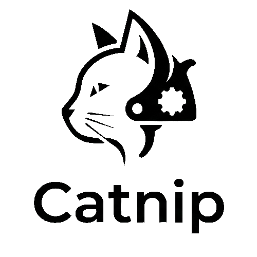

  

## What is this?
Catnip is protocol/framework for creating Bluetooth enabled airsoft FCUs

## Compatibility

Currently theres implementations for ESP32 based boards (BLE required). Any board that has BLE that can talk the Catnip protocol will work in the phone app

Phone app is IOS and Android compatible

## Structure

[Phone App](./catnip_app/)
This folder contains the React Native app for phones  
[Core](./catnip_core/)
This folder contains the traits, BLE constants, requests, events and responses  
[ESP32](./catnip_esp32/)
This folder contains an implementation of Catnip for ESP32 boards  
[Engines](./engines/)
This folder contains firmware for some FCUs  